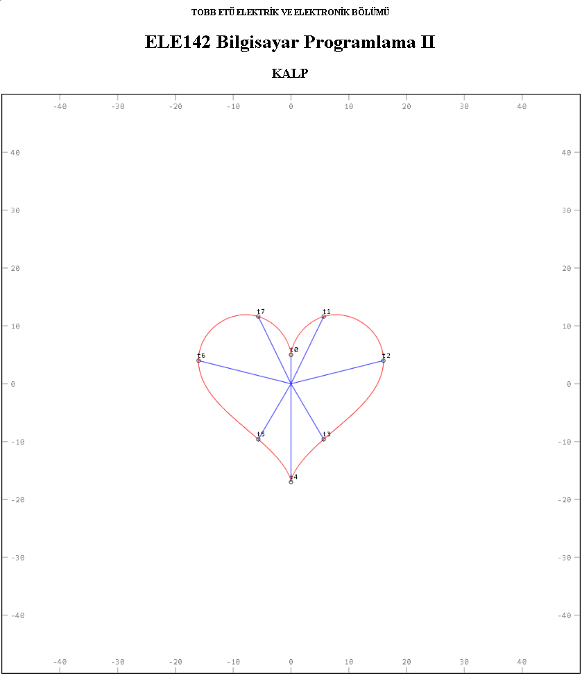
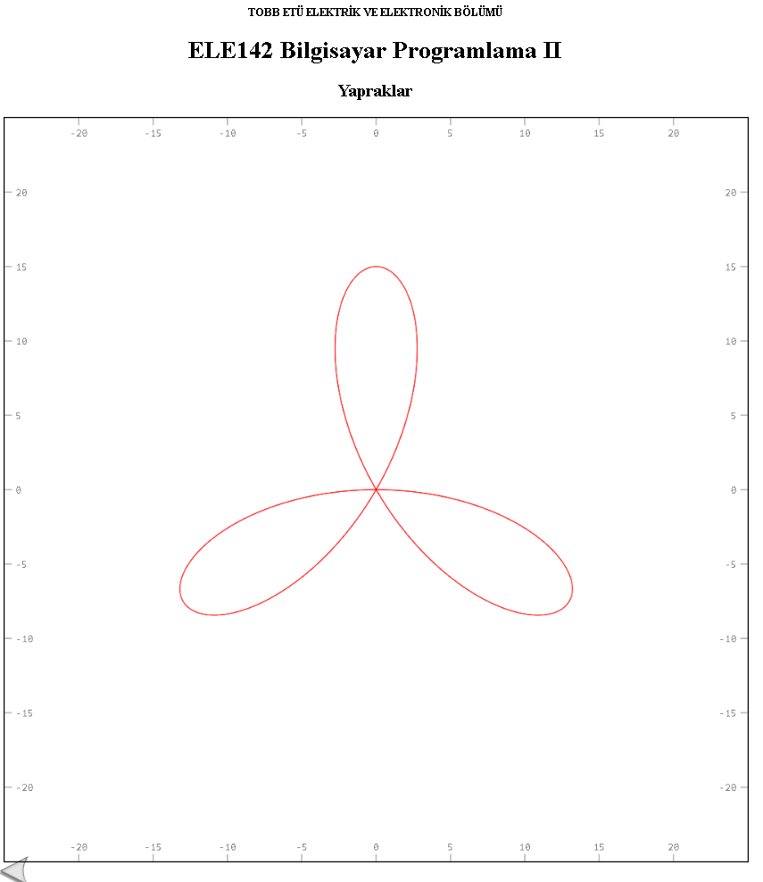
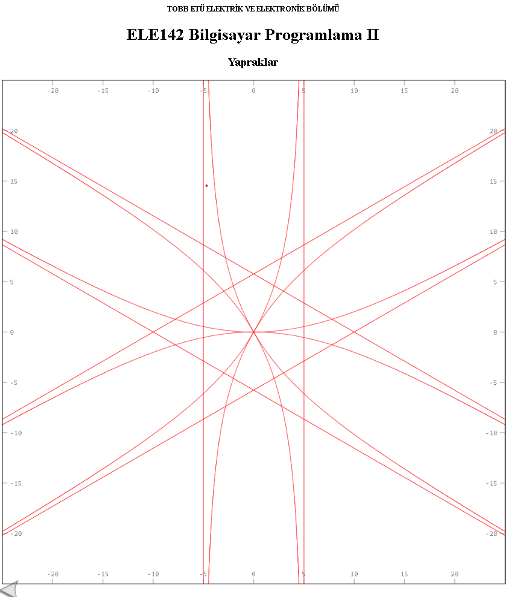

# Parametrik ve Kutupsal Eğri Çizici (C++ to HTML5 Canvas)

Bu proje, **Kalkülüs II (MAT 102)** dersindeki teorik matematiksel kavramları (parametrik denklemler ve kutupsal koordinatlar), **Bilgisayar Programlamaya Giriş II (ELE 142)** dersinde öğrenilen programlama becerileriyle görselleştirmek amacıyla geliştirilmiştir. C++ tabanlı `canvas` kütüphanesi kullanılarak, iterasyonla hesaplanan noktalar doğrudan interaktif bir HTML5 dosyasına çizdirilmektedir.

## İçerik ve Özellikler

### 1. Kalp Eğrisi ve Konum Vektörleri (Parametrik Eğriler)
Matematikteki meşhur parametrik kalp denklemi kullanılarak çizilmiştir. Sadece eğrinin kendisi değil, eğrinin zamana ($t$) bağlı olarak hangi yönde (yönelim/orientation) çizildiğini pedagojik olarak göstermek için orijinden çıkan **konum vektörleri** ($t_0, t_1, ... t_7$) koda entegre edilmiştir. Bu eklenti, parçacığın yörünge üzerindeki hareketini ve zaman akışını anlamayı görsel olarak kanıtlar.

### 2. Gül Yaprakları (Kutupsal Koordinatlar)
Kutupsal koordinatlardaki $r = a \sin(n\theta)$ ve $r = a \cos(n\theta)$ formatındaki "Gül Eğrileri" (Rose Curves) koda dökülmüştür. 
* Kural gereği $n$ tek sayı olduğunda **$n$ adet**, $n$ çift sayı olduğunda **$2n$ adet** yaprak oluştuğu simülasyon üzerinden doğrulanmıştır. 
* Geliştirilen algoritma ile kutupsal denkleme **faz kayması** (açısal öteleme) uygulanarak, elde edilen şekillerin orijin etrafında istenilen açıda kusursuzca döndürülmesi sağlanmıştır.

### Ayrıca asimptot barındıran (örneğin tanjant içeren) fonksiyonlar da test edilmiştir

##  Teknik Altyapı ve Nasıl Çalışır?
* **Dil:** C++ (Minimum C++11 standardı)
* **Görselleştirme:** Hesaplanan $(x, y)$ koordinatları, `canvas.cpp` kütüphanesi aracılığıyla tarayıcıda çalıştırılabilir bir `.html` dosyasına (JavaScript Canvas API) dönüştürülür.
* **Dönüşüm Mantığı:** Kutupsal $(r, \theta)$ koordinatlarından kartezyen $(x, y)$ düzlemine anlık trigonometrik dönüşümler yapılır. Web tarayıcılarını yormamak adına iterasyon adımları ($N=2000$) optimize edilmiş ve pürüzsüz (anti-aliased) bir çizim kalitesi elde edilmiştir.

##  Kurulum ve Çalıştırma
1. Repoyu bilgisayarınıza klonlayın.
2. `cizim.cpp` ve/veya `yapraklar.cpp` dosyasını  derleyin.
3. Oluşan çalıştırılabilir dosyayı başlattığınızda, proje dizininde otomatik olarak `.html` uzantılı bir çıktı dosyası oluşacaktır.
4. Çıktı dosyasını herhangi bir web tarayıcısında açarak çizimi görüntüleyebilirsiniz.